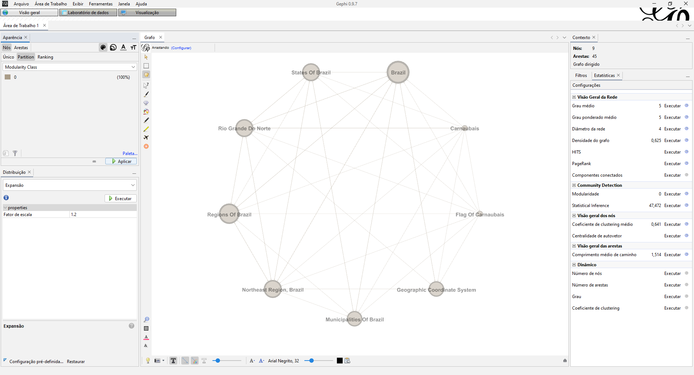

# Trabalho 3 - Unidade 2

**Alunos : Efrain Marcelo Pulgar Pantaleon e Pedro Leandro Batista Marques**

## Como Rodar o Projeto

Para rodar o arquivo ```atividade3U2.ipynb``` temos 2 opções:

1) Rodar o arquivo pelo [Google Colaboratory](https://colab.research.google.com/) via upload.
 - Será necessário tirar as '#' do primeiro script, pois ele instalará dependências necessárias.

2) Rodar Via VsCode
 - Será necessário criar um ambiente virtual com o comando ```python -m  venv venv```
 - Ativar o ambiente virtual com o comando ```./venv/Scripts/activate```
 - Após ativarmos o ambiente, basta rodar o comando ```pip install -r requirements.txt``` para instalar as dependências do projeto automaticamente

## Video Explicativo da primeira parte do Projeto

Para a atividade, produzimos um video para descrever os resultados obtidos em nossos estudos e como ele foi realizado.Para acessar o video, basta clicar [aqui](https://drive.google.com/file/d/1F-gvBDnlAqdj57dAySGQRvHpFpePPI1O/view)

## Breve descrição do projeto e dos resultados

O objetivo deste projeto é gerar uma rede dirigida a partir de links das páginas da wikipedia. A página que escolhemos, foi a página de [carnabauis](https://pt.wikipedia.org/wiki/Carnaubais), que é um município do interior do estado do Rio Grande do Norte. A página escolhida (assim como todas as outras na wikipedia) referenciam/citam outras páginas, e com isso, pode-se gerar um *grafo dirigido* a partir desses links das páginas. 

### Requisito 1
---
A rede que geramos se limita a ```duas camadas``` de profundidade, ou seja, a primeira camada é a própria página de [carnabauis](https://pt.wikipedia.org/wiki/Carnaubais) e a segunda camada são as páginas que a página de [carnabauis](https://pt.wikipedia.org/wiki/Carnaubais) cita. Abaixo estão as páginas que encontramos nessas duas camadas:

```
0 Carnaubais
1 Brazil
1 Flag Of Carnaubais
1 Geographic Coordinate System
1 Municipalities Of Brazil
1 Northeast Region, Brazil
1 Regions Of Brazil
1 Rio Grande Do Norte
1 States Of Brazil
1 Time Zone
```

Apesar da pouca quantidade de páginas presentes nessas camadas quando averiguamos a quantidade de nós e conexões da rede nos deparamos com a seguinte situação:

```
Quantidade de Nós: 2358
Quantidade de Conexões: 3357
```

Então, foi feito um tratamento para *remover autocitações*, *remover citações duplicadas* e dentre outros métodos para limpar a rede. Daí, ficamos apenas com:  

```
Quantidade de Nós: 9
Quantidade de Conexões: 45
```

Quando analisamos a métrica ```in-degree```, que é uma métrica que diz respeito a quantas conexões chegam em um nó, ou seja, no nosso caso seria quantas vezes uma página foi citada, abaixo percebe-se que a página do *Brazil* foi a mais citada dentro da nossa rede.

```
8 Brazil
7 Regions Of Brazil
6 States Of Brazil
6 Northeast Region, Brazil
6 Rio Grande Do Norte
5 Geographic Coordinate System
5 Municipalities Of Brazil
1 Carnaubais
1 Flag Of Carnaubais
```

Foi gerada uma imagem da rede para visualizá-la melhor:


### Requisito 2
---

Apesar da análise da métrica ```in-degree``` nos permitir visualizar quem foi a página mais citada, apenas essa métrica não é suficiente para uma análise mais detalhada da nossa rede. Logo, geramos uma imagem com outras quatro métricas: ```degree centrality```, ```closeness centrality```, ```betweeness centrality``` e ```eigenvector centrality```.


Observando a escala de cores, a página do *Brazil* é a que tem o maior ```degree centrality```, ou seja, ela é a página que mais foi citada. Quando analizamos a métrica ```closeness centrality```, observamos que a página do *Brazil* é a que tem essa maior métrica, ou seja, ela é a página que está mais próxima das outras. Já quando analizamos a métrica ```betweeness centrality```, vemos que as páginas que tem essa maior métrica são as páginas do *Brazil* e a do *Rio Grande do Norte*, ou seja, essas são as páginas que mais participam do fluxo de informação. Por fim, a página que possui o maior ```eigenvector centrality``` é a página do *Brazil*, ou seja, ela contém mais páginas vizinhas *importantes*.

### Requisito 3
---

Com essa rede, também construímos um *histograma*, um de *Função Densidade Probabilidade* (```PDF```) e um Gráfico de *Função Densidade acumulada* (```CDF```) com relação a métrica ```degree``` da rede.

Histograma:


Função Densidade Probabilidade (```PDF```):


Função Densidade acumulada (```CDF```):


Ao analizar a ```CDF``` da rede, vemos que cerca de *60% das páginas (nós) da rede possuem 10 ou menos páginas vizinhas*.

### Requisito 4
---
Também geramos uma imagem com vários gráficos das 4 métricas do requisito 2. A diagonal principal da imagem contém a ```PDF``` da rede com relação as métricas da coluna ao lado, as imagens acima da diagonal principal são *scatter plots* de uma métrica em relação a outra (observar a legenda da imagem) e as imagens abaixo da diagonal principal são outra forma de visualizar o scatter plot correspondente (nese caso, quanto mais próximo da cor branca, maior é a métrica).


### Requisito 5

Por fim, geramos uma imagem com o núcleo (```core```) e casca (```shell```) da rede:


## Visualizações de análises de rede com Gephi

Todas as análises e visualizações desenvolvidas até então foram feitas utilizando bibliotecas do *python*, porém, a partir de agora, iremos nos aproveitar do arquivo ```.graphml``` gerado anteriormente e visualizar a rede com ajuda da ferramenta ```gephi```.

### Visualização da rede de forma iterativa
---

A primeira coisa que fizemos foi criar uma rede iterativa com o plugin ```SigmaExporter``` do gephi. Com este plugin, podemos gerar uma rede iterativa que pode ser acessada [aqui](https://pelean2812.github.io/data_structure2_netdeploy/network/). Abaixo está uma imagem do site com a rede iterativa:


Para criar esta rede iterativa, inicialmente tentamos colorir os nós (página da wikipedia) de acordo com as *comunidades* que cada nó pertence. Porém, quando utilizamos o gephi para "calcular" as comunidades seja pela propriedade ```Modularity Class``` ou ```Inferred Class``` vemos que todos os nós são da mesma comunidade, logo eles ficariam pintados da mesma cor. As figuras abaixo mostram isso:




Então, a métrica que utilizamos para colorir os nós da rede foi a ```In degree``` que mede a quantidade de vezes que uma página foi citada. Logo, os nós da mesma cor são os nós que possuem a mesma quantidade de citações. Como pode-se ver abaixo (e na rede iterativa [aqui](https://pelean2812.github.io/data_structure2_netdeploy/network/)), há 3 páginas que possuem a mesma cor (rosa), essas são páginas que tem 6 citações, há duas páginas com a cor azul, e enfim, basta visualizar a rede iterativa para ver quais são as páginas que pertecem a ao mesmo grupo de cores:


### Análise da rede com a ferramenta Retina
---

Além da análise/aprimoramentos que fizemos na rede utilizando a ferramenta gephi, também fizemos uma análise da rede utilizando a ferramenta ```retina```. Nela, analisamos três parâmetros da rede: ```page rank```, ```in degree``` e ```betweness centrality```. Abaixo está um print da ferramenta sendo utilziada com a nossa rede:


Neste [video](https://drive.google.com/file/d/1nwrlnNuCOGD810i7gx6n0N5VSkIM5OG1/view?usp=sharing) explicamos com maiores detalhes a análise que fizemos dessa rede utilizando a ferramenta retina.

### Artes da rede geradas com o Gephisto
---

Por fim, criamos algumas artes da nossa rede utilizando a ferramenta ```gephisto```:


De forma simplificada, a interpretação que podemos tirar da primeira arte acima é que quanto maior é o tamanho da bola, maior é a métrica ```Harmonic Closeness Centrality```, que é uma métrica que irá dizer o quão "próxima" uma página é da outra (só que de forma "normalizada"). Visualmente, as páginas que estão mais distantes de todas as outras da rede são as páginas *Regions of Brazil* e *Miniciplalities of Brazil*. Observe também que as páginas com o mesmo índice de clusterização estão circundadas com a mesma cor. (Maiores detalhes estão na própria legenda da imagem)


De forma simplificada, a interpretação que podemos tirar dessa segunda arte é que quanto maior é o tamanho da bola, maior é a métrica ```degree```, que em uma rede dirigida, indica quantas vezes uma página foi citada ou cita outras páginas. Visualmente, a página do *Brazil* é a que mais tem citações. (Maiores detalhes estão na própria legenda da imagem)

### Referências
Repositório de Algorítmos e Estruturas de dados II do Professor Ivanovitch [](https://github.com/ivanovitchm/datastructure)
